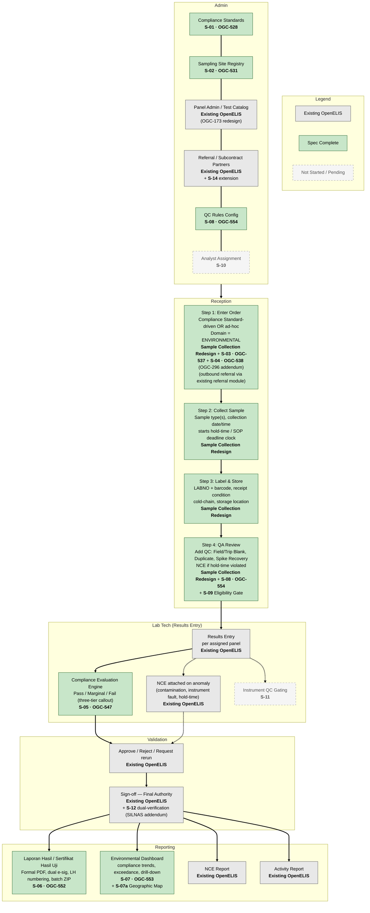

# OpenELIS Global — Environmental and Vector Workflows

**Audience:** OpenELIS Global developers joining the Env/Vector Epic (OGC-527) work.
**Purpose:** Give devs a shared mental model of how each workflow moves from admin setup through reporting, using the swimlane + narrative format. This supersedes earlier draft flows that assumed a clinical-style supervisor escalation pattern.
**Date:** 2026-04-23

---

## Shared conventions (both workflows)

- **Order entry uses a 4-step wizard** at Reception: Step 1 Enter Order → Step 2 Collect Sample → Step 3 Label & Store → Step 4 QA Review. Source: Sample Collection Redesign FRS v2.
- **Sample domain** is set via the OGC-296 enum (`CLINICAL` | `ENVIRONMENTAL` | `VECTOR` | `BOTH`) at order entry and drives downstream routing, panel filtering, and reporting.
- **Validator is the final authority** — there is no supervisor escalation lane. Validation is Approve / Reject / Request rerun → sign-off → release to reporting. (The S-12 dual-verification pipeline is a SILNAS-specific future addendum and is not in scope for v1.)
- **Anomalies are handled via NCE** (Non-Conformance Event), an existing OpenELIS concept. NCE attaches to the result as a flag + note. Do not invent new anomaly types.

## How to read the diagram annotations

Each step is colour-coded by status and labeled with its governing spec + Jira ticket:

| Colour | Meaning |
|---|---|
| Gray fill | **Existing OpenELIS** — already in the shipped product, reused as-is. |
| Green fill | **Spec Complete** — FRS, mockup, and Jira ticket exist. Build status varies; check Jira. |
| Dashed gray | **Not Started / Pending** — roadmap item, no FRS yet. Dashed boxes are future addendums. |
| Yellow callout | Behavioural note / decision point worth highlighting to devs. |

Ticket references use the format `<spec-id> · <Jira ID>` (e.g., `S-05 · OGC-547`). Cross-epic tickets (OGC-173, OGC-296, OGC-447) are called out inline where they govern a step.

---

## 1. Environmental Workflow

### 1.1 Swimlane Diagram (Mermaid)

### 1.2 Narrative — How an Environmental sample moves through OpenELIS

**Admin setup (pre-conditions).** Before any Env sample can be ordered, an admin has configured three catalogs. Compliance Standards (S-01) define the regulation-driven bundles — e.g., "Drinking Water — National Standard 2023" — and each bundle maps to required sample types, required panels, and evaluation thresholds. The Sampling Site Registry (S-02) holds the addressable sites a customer owns (a bottling plant, a municipal intake, a hospital cafeteria water line). Panel Admin defines the individual analyte panels and their evaluation thresholds that the Compliance Evaluation Engine will use later at S-05. Subcontract Partners (S-03c) are configured if the lab routinely outsources specific tests. Future addendums — S-08 QC Rules and S-10 Analyst Assignment — are not yet in place; in v1 the lab tech assumes the QC rule set informally and work is claimed rather than routed.

**Reception — the 4-step wizard.** When a customer arrives (or calls ahead), Reception opens the order entry wizard. In Step 1, Reception chooses a path: either pick a Compliance Standard (which prefills sample types, panels, and thresholds), or go ad-hoc and pick tests directly from the catalog. The sample domain is set to `ENVIRONMENTAL`. If the order requires a subcontracted test, Reception marks that test as an outbound referral per S-03c (this survived the wizard redesign and still lives on the order-level). Step 2 records the physical sample collection — sample type(s), collection date/time (which starts the SOP hold-time clock via S-03d). Step 3 assigns the accession (LABNO plus barcode), captures receipt condition and cold-chain state, and puts the sample into a tracked storage location per S-05b. Step 4 is QA Review: Reception attaches the required QC samples for this batch (Field Blank, Trip Blank, Duplicate, Spike Recovery per the S-08 taxonomy) and, if the hold-time clock is already in violation, flags an NCE on the sample before it leaves Reception.

**Lab Tech — results entry.** The lab tech opens the sample and enters results against the assigned panel(s). As results save, the Compliance Evaluation Engine (S-05) evaluates each analyte against the threshold set associated with the Compliance Standard or panel and returns a per-analyte disposition of Pass, Marginal, or Fail. This three-tier result surfaces immediately in the tech's UI as a colored callout so the tech can spot marginal values before moving on. If the tech notices an anomaly during run (contamination signal, instrument fault, or a hold-time violation that's just been realized), they attach an NCE to the sample. The NCE rides the sample as a flag and note downstream — it does not block validation by itself.

**Validation.** Validation is a single, flat step. The validator sees the sample, the per-analyte evaluation, any NCEs, and the raw result values. They Approve, Reject, or Request a rerun. On approval, the sample is signed off and released to Reporting. The validator is the final authority — there is no supervisor queue above them in v1. (If your project is a SILNAS deployment that has adopted the S-12 addendum, dual verification happens *before* validation, not *after*; the validator's authority is unchanged.)

**Reporting.** Three outputs leave the system for Env in v1. The Laporan Hasil / Sertifikat Hasil Uji (S-06) is the formal customer-facing PDF with dual e-signatures and a sequential LH number, and can be batch-exported as a ZIP. The NCE Report (existing) rolls up all non-conformance events attached to samples in a period. The Activity Report (existing) summarizes throughput. S-06b LH Delivery Notification is a future addendum — in v1, delivery is manual.

### 1.3 Related tickets / specs

Epic: **[OGC-527](https://uwdigi.atlassian.net/browse/OGC-527)** (Environmental & Vector Testing Module)

| Spec | Jira | Status |
|---|---|---|
| S-01 Compliance Standards Administration | [OGC-528](https://uwdigi.atlassian.net/browse/OGC-528) | Spec Complete |
| S-02 Sampling Site Registry | [OGC-531](https://uwdigi.atlassian.net/browse/OGC-531) | Spec Complete |
| Sample Collection Redesign (4-step workflow) | *(pre-existing, FRS v2.0)* | Spec Complete |
| S-03 Environmental Order Entry Integration | [OGC-537](https://uwdigi.atlassian.net/browse/OGC-537) | Spec Complete |
| S-04 Sample Domain Classification (addendum to OGC-296) | [OGC-538](https://uwdigi.atlassian.net/browse/OGC-538) / [OGC-296](https://uwdigi.atlassian.net/browse/OGC-296) | Spec Complete / OGC-296 In Progress |
| S-05 Compliance Evaluation Engine | [OGC-547](https://uwdigi.atlassian.net/browse/OGC-547) | Spec Complete |
| S-06 Laporan Hasil (Compliance Report) | [OGC-552](https://uwdigi.atlassian.net/browse/OGC-552) | Spec Complete |
| S-07 Environmental Dashboard & Trend Analysis | [OGC-553](https://uwdigi.atlassian.net/browse/OGC-553) | Spec Complete |
| S-08 Environmental QC Rules | [OGC-554](https://uwdigi.atlassian.net/browse/OGC-554) | Spec Complete |
| S-07a Geographic Map Dashboard View (addendum) | TBD | Not Started |
| S-09 Pre-Analytical Eligibility Gate & Resampling | TBD | Not Started |
| S-10 Sample Distribution & Analyst Assignment | TBD | Not Started |
| S-11 Instrument QC Gating (addendum) | TBD | Not Started |
| S-12 Dual Verification Pipeline (SILNAS addendum) | TBD | Not Started |
| S-14 Inter-Lab Sample Transfer & Referral (addendum) | TBD | Not Started |
| S-15 Bulk Sample Import CSV/XLS (addendum) | TBD | Not Started |
| S-13 Payment & Billing | — | Deferred (awaiting contractor) |

---

## 2. Vector Workflow

### 2.1 Swimlane Diagram (Mermaid)

```mermaid
flowchart TD
    classDef existing fill:#e8e8e8,stroke:#555,color:#000
    classDef specComplete fill:#c8e6c9,stroke:#1b5e20,color:#000
    classDef notStarted fill:#f5f5f5,stroke:#999,color:#555,stroke-dasharray: 5 5
    classDef callout fill:#fffbe6,stroke:#d4a017,color:#000
    classDef primary fill:#e6f4ff,stroke:#1976d2,color:#000
    linkStyle default stroke:#000,stroke-width:2.5px,color:#000

    subgraph LEGEND[" Legend "]
        direction LR
        LG1["Existing OpenELIS"]:::existing
        LG2["Spec Complete"]:::specComplete
        LG3["Not Started / Pending"]:::notStarted
        LG4["Primary path"]:::primary
    end

    subgraph ADMIN[" Admin "]
        direction TB
        VA1["Vector Surveillance<br/>Groups / Species / Trap Types / Pending Updates<br/><b>V-01 &middot; OGC-555</b>"]:::specComplete
        VA2["Panel Admin (Vector domain extension)<br/><b>Existing OpenELIS</b> + <b>V-03</b> panel-domain extension"]:::existing
        VA3["FHIR Catalog Subscription<br/>hub-delivered reference data<br/><b>OGC-447</b> (Backlog)"]:::notStarted
        VA4["Analyst Assignment / Instrument QC Gating<br/><b>S-10</b> / <b>S-11</b>"]:::notStarted
        VA1 --- VA2 --- VA3 --- VA4
    end

    subgraph RECEPTION[" Reception "]
        direction TB
        VR0a["Intake Path 1 &mdash; FHIR Referral-in (primary)<br/>FHIR Task tracks origin<br/>FHIR Sample imports species ID if present<br/>&rarr; skip morph ID downstream<br/><b>Existing referral/FHIR</b> + <b>V-02</b> + <b>S-14</b>"]:::primary
        VR0b["Intake Path 2 &mdash; Paper/CSV manifest<br/>transcription from external source<br/><b>V-02</b> + <b>S-15</b> Bulk Import"]:::notStarted
        VR0c["Intake Path 3 &mdash; Direct field entry<br/>(lowest priority) full collection event<br/><b>V-02</b>"]:::notStarted
        VR1["Step 1: Enter Order<br/>Domain = VECTOR, module code = VCT<br/><b>Sample Collection Redesign</b> + <b>V-02</b>"]:::notStarted
        VR2["Step 2: Collect Sample<br/>Referral: Receipt Confirmation + Cooler/Shipment ID<br/>Field entry: Trap type, GPS, Pool flag, Organism count, Weather<br/><b>V-02</b>"]:::notStarted
        VR3["Step 3: Label &amp; Store<br/>LABNO + barcode; pools: LABNO.1, LABNO.2, &hellip;<br/><b>Sample Collection Redesign</b> + <b>V-02</b>"]:::notStarted
        VR4["Step 4: QA Review<br/>(Eligibility Gate)<br/><b>S-09</b>"]:::notStarted
        VR0a --> VR1
        VR0b --> VR1
        VR0c --> VR1
        VR1 --> VR2 --> VR3 --> VR4
    end

    subgraph LABTECH[" Lab Tech (Results Entry) "]
        direction TB
        VL1["Species Identification Workbench<br/>Per-specimen + bulk-apply<br/>Method: MORPH / MOLECULAR / BOTH<br/>Confidence: CONFIRMED / PRESUMPTIVE<br/>Molecular: target gene, assay, GenBank<br/>&rarr; SKIP if FHIR Sample carried species ID<br/><b>V-03</b>"]:::notStarted
        VL2["Pathogen testing per panel<br/><b>Existing OpenELIS</b> + <b>V-03</b> panel extension"]:::existing
        VL3["Deconvolution Workflow<br/>(if pool flag + positive result)<br/>Sub-pools: LABNO.1-1, LABNO.1-2, &hellip; (iterative)<br/><b>V-03</b><br/>(FRS labeling update pending &mdash; see handoff prompt)"]:::callout
        VL4["NCE attached on anomaly<br/><b>Existing OpenELIS</b>"]:::existing
        VL1 --> VL2 --> VL3
        VL2 -.-> VL4
    end

    subgraph VAL[" Validation "]
        direction TB
        VV1["Approve / Reject / Request rerun<br/><b>Existing OpenELIS</b>"]:::existing
        VV2["Sign-off &mdash; Final Authority<br/><b>Existing OpenELIS</b><br/>+ <b>V-04</b> adds Verificator&rarr;Validator pipeline"]:::existing
        VV1 --> VV2
    end

    subgraph REP[" Reporting "]
        direction TB
        VP1["Client Certificate<br/>(reuse S-06 LH pattern)<br/>Routed upstream via FHIR Task<br/>Consolidated lineage: pool +ve &rarr; sub-pool &rarr; individual<br/><b>S-06 &middot; OGC-552</b> + <b>V-04</b>"]:::notStarted
        VP2["Vector Surveillance Dashboard<br/>Apache Superset embedded (guest-token iframe)<br/>HAPI FHIR &rarr; OHS SQL-on-FHIR views<br/>MIR calc, 6 dashboards, PDF export<br/><b>V-04</b>"]:::notStarted
    end

    ADMIN --> RECEPTION
    VR4 --> VL1
    VL3 --> VV1
    VL4 -.-> VV1
    VV2 --> VP1
    VV2 --> VP2
```

### 2.2 Narrative — How a Vector sample moves through OpenELIS

**Admin setup (pre-conditions).** Vector has its own admin neighborhood under Vector Surveillance (V-01) with three catalogs — Groups (e.g., *Culicidae*), Species (e.g., *Aedes aegypti*), Trap Types (e.g., BG-Sentinel, CDC light trap) — plus a Pending Updates queue that holds changes pushed from the FHIR hub via the OGC-447 Catalog Subscription before they're accepted locally. Panel Admin defines the pathogen-testing panels used for Vector, with Panel Domain set to `VECTOR` or `ALL`. Future addendums S-10 (analyst assignment) and S-11 (instrument QC gating) are not in v1.

**Reception — three intake paths feed the same wizard.** The primary Vector intake is **Path 1: FHIR Referral-in.** Another lab (typically another OpenELIS site) has already received the trap, done the field-side capture, and is forwarding pools for pathogen testing. A FHIR Task is created in OpenELIS to track the referral's origin and route the final result back upstream when reporting is done. If the referring lab's FHIR Sample resource already carries a species identification, that ID is imported alongside the sample and morph ID is skipped downstream. **Path 2** is a paper or CSV manifest transcription when the upstream partner isn't on FHIR. **Path 3** (lowest priority for v1) is direct field entry where the receiving lab is also the collecting lab — in that case Step 2 captures the full collection event (trap type, GPS pre-filled from the site, pool flag, organism count, weather accordion). Whichever path was used, the order moves into the same 4-step wizard: Step 1 sets the domain to `VECTOR` and assigns the VCT module code; Step 2 records either Receipt Confirmation (referral — Cooler/Shipment ID, condition) or the collection event (field entry); Step 3 assigns the accession with each pool getting its own real LABNO aliquot (`LABNO.1`, `LABNO.2`, …) so lab ops can track physical objects; Step 4 is labeled **QA Review (Eligibility Gate — pending S-09)** — the full pre-analytical eligibility gate is a future addendum, so in v1 this step is a light QA pass.

**Lab Tech — species ID, pathogen testing, and deconvolution.** The first stop on the bench is the Species Identification Workbench. The tech can work per-specimen or bulk-apply. Method is one of MORPHOLOGICAL, MOLECULAR, or BOTH; confidence is CONFIRMED or PRESUMPTIVE. For molecular IDs, target gene, assay name, and GenBank accession are captured. **If the referral's FHIR Sample carried a species ID at intake, this whole step is skipped** — the ID imports as-is. Once species are fixed, pathogen testing runs per the assigned panel. If the pool flag is set and at least one pathogen result comes back positive, the Deconvolution Workflow opens. Sub-pools (or individuals) extracted from the positive pool are numbered using OpenELIS's aliquot convention: `LABNO.1-1`, `LABNO.1-2`, …, and the pattern is iterative — a sub-pool that itself tests positive can be further deconvoluted as `LABNO.1-1-1`, `LABNO.1-1-2`, and so on. Each child specimen gets a real accession and barcode so lab ops can handle it physically, but on the customer-facing certificate the lineage is consolidated back under the parent pool (see Reporting). NCEs for anomalies attach the same way as Env.

**Validation.** Identical to Env: Approve / Reject / Request rerun → sign-off → release. Validator is final authority in v1.

**Reporting.** Vector produces two outputs in v1. The **Client Certificate** reuses the S-06 Laporan Hasil PDF pattern (dual e-signature, sequential numbering, batch ZIP) and is routed back to the upstream referring lab via the FHIR Task that was opened at intake. The certificate tells a consolidated lineage narrative — pool *X* tested positive → sub-pool *X.1-1* traced → specimen *X.1-1-2* identified — rather than exposing each child LABNO as a separate line. The **Vector Surveillance Dashboard** (V-04) is served by Apache Superset embedded via a guest-token iframe inside OpenELIS Reports → Vector Surveillance. The data pipeline is OpenELIS → HAPI FHIR → Postgres (OHS SQL-on-FHIR views) → Superset, with 6 pre-built dashboards, MIR (Minimum Infection Rate) calculation, and PDF export. Permissions are `vectorReport.view`, `vectorReport.export`, `vectorReport.openSuperset`.

### 2.3 Open items / decisions deferred

- **V-03 FRS update:** deconvolution child-specimen labeling needs to be changed from the currently-drafted `[parentLotId]-D[n]` pattern to the aliquot-style `LABNO.X-Y` convention shown above. Handoff prompt is in `v03-frs-deconvolution-handoff-prompt.md`.
- **S-03c in the redesigned wizard:** outbound referral at order entry existed in the pre-redesign flow and should still be reachable after Sample Collection Redesign v2 — needs a dev conversation to confirm it wasn't dropped.
- **Vector Client Certificate** is not explicitly enumerated in the V-04 FRS (V-04 is dashboard-focused). In v1 we are treating the Client Certificate as a straight reuse of the S-06 LH pattern with Vector-specific lineage consolidation. If a separate Vector Certificate FRS is needed, it should be authored before build.

### 2.4 Related tickets / specs

Epic: **[OGC-527](https://uwdigi.atlassian.net/browse/OGC-527)** (Environmental & Vector Testing Module)

| Spec | Jira | Status |
|---|---|---|
| V-01 Vector Specimen Types & Taxonomy | [OGC-555](https://uwdigi.atlassian.net/browse/OGC-555) | Spec Complete |
| V-02 Vector Collection Workflow | TBD | Not Started (FRS draft in uploads) |
| V-03 Vector Testing & Identification | TBD | Not Started (FRS draft in uploads; deconvolution labeling update pending) |
| V-04 Vector Surveillance Reporting | TBD | Not Started (FRS draft in uploads) |
| OGC-296 Sample Type Management (domain enum) | [OGC-296](https://uwdigi.atlassian.net/browse/OGC-296) | In Progress |
| OGC-447 FHIR Catalog Subscription | [OGC-447](https://uwdigi.atlassian.net/browse/OGC-447) | Backlog |
| S-06 Laporan Hasil (reused for Vector Client Certificate) | [OGC-552](https://uwdigi.atlassian.net/browse/OGC-552) | Spec Complete |
| Cross-cutting addendums consumed by Vector: S-09 (eligibility), S-10 (distribution), S-11 (instrument QC), S-14 (transfer), S-15 (bulk import) | TBD | Not Started |
