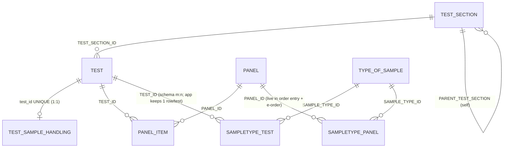

# Test Catalog Data Model — Source-Verified Reference

> **Status:** Verified against `DIGI-UW/OpenELIS-Global-2` @ `develop`, 2026-07-14.
> Every schema claim below was read from the entity class, hbm/JPA mapping, or liquibase
> changeset cited inline. Claims that could *not* be re-verified are flagged explicitly.
> Intended home: `openelis-design/references/verified-data-models.md` (link from the
> Panel / Sample Type / Lab Unit FRSes instead of re-deriving).

---

## 1. ER overview

Key structural facts (each expanded in §2):

- **TEST has no sample-type column.** The test↔specimen association exists *only* in
  `SAMPLETYPE_TEST`. "One specimen per test" is an application write-path convention,
  not a schema constraint.
- **No junction has a composite unique constraint.** `panel_item(panel_id,test_id)`,
  `sampletype_test(sample_type_id,test_id)`, and `sampletype_panel` pairs are all
  unconstrained at the DB level. Duplicate rows are prevented only by application code.
- **Domain exists on TEST only** (varchar(20), NOT NULL, CHECK
  `CLINICAL|ENVIRONMENTAL|VECTOR`). TypeOfSample has a *legacy* one-char `DOMAIN`
  (convention `'H'`). **Panel and TestSection have no domain column** on develop.
- **TEST_SAMPLE_HANDLING is strictly 1:1 with TEST** (unique FK), the only junction-free
  satellite in the model.

---

## 2. Entities (verified field lists)

### 2.1 Test — table `TEST`
`test/valueholder/Test.java` · `hibernate/hbm/Test.hbm.xml` · `liquibase/3.5.x.x/040-test-domain-amr-whonet.xml`

| Column | Notes |
|---|---|
| `ID` numeric(10) | seq `test_seq`; version col `LASTUPDATED` |
| `DESCRIPTION` varchar(60) | NOT NULL, **unique** |
| `NORMALIZED_DESCRIPTION` varchar(255) | maintained by DB trigger (per Javadoc) |
| `LOCAL_CODE` varchar(10) | unique |
| `LOINC` varchar(240) | **single column — one LOINC per test row** |
| `DOMAIN` varchar(20) | NOT NULL DEFAULT `'CLINICAL'`, CHECK `IN ('CLINICAL','ENVIRONMENTAL','VECTOR')` (changeset `OGC-936-test-domain-column`) |
| `TEST_SECTION_ID` FK | → TEST_SECTION (lab unit) |
| Other FKs | `LABEL_ID`, `name_localization_id`, `reporting_name_localization_id`, `UOM_ID`, `SCRIPTLET_ID`, `METHOD_ID`, `TEST_TRAILER_ID`, `default_test_result_id` |
| Flags/misc | `IS_ACTIVE`, `ACTIVE_BEGIN/END`, `IS_REPORTABLE`, `STICKER_REQ_FLAG`, `orderable`, `notify_results`, `in_lab_only`, `antimicrobial_resistance` (reused as the AMR flag), `guid`, `name`, `SORT_ORDER`, TAT columns (`TIME_HOLDING`, `TIME_WAIT`, `TIME_TA_AVERAGE/WARNING/MAX`), `LABEL_QTY` |

**No `typeOfSample` property or column.** `TestService.getTypeOfSample(test)` resolves it
by fetching the test's `SAMPLETYPE_TEST` rows and **taking the first one**
(`TestServiceImpl` → `typeOfSampleTestService.getTypeOfSampleTestsForTest(id).get(0)`).

Changeset 040 also creates `whonet_antibiotic_codes` and `test_amr_config`
(`test_id` UNIQUE → 1:1 with Test).

### 2.2 Panel — table `PANEL`
`panel/valueholder/Panel.java` · `hibernate/hbm/Panel.hbm.xml`

| Column | Notes |
|---|---|
| `ID` numeric(10) | seq `panel_seq`; version `LASTUPDATED` |
| `NAME` varchar(20) | `panelName` |
| `DESCRIPTION` varchar(60) | NOT NULL |
| `LOINC` varchar(10) | single |
| `name_localization_id` FK | → Localization |
| `sort_order` integer, `is_active` | |

**Confirmed absent:** code, lab-unit/test-section FK, sample-type column, **domain**.
No `3.5.x.x` changeset touches `panel` (searched `tableName="panel"` — zero hits), so the
panel-effort domain column is **not yet on develop**; the Panels FRS must treat it as
proposed, with its own migration.

### 2.3 PanelItem — table `PANEL_ITEM`
`panelitem/valueholder/PanelItem.java` · `hibernate/hbm/PanelItem.hbm.xml`

`ID` (seq `panel_item_seq`), `PANEL_ID` FK NOT NULL, `TEST_ID` FK NOT NULL,
`SORT_ORDER` numeric, **plus two often-forgotten columns**: `TEST_LOCAL_ABBREV`
varchar(10) (`testName`; hbm column-level `unique="true"`, a bugzilla-2559 relic) and
`METHOD_NAME` varchar(20). **No per-test LOINC** (confirmed). **No unique constraint on
(PANEL_ID, TEST_ID)** — duplicate membership is only app-prevented.

### 2.4 TypeOfSample (Sample Type) — table `TYPE_OF_SAMPLE`
`typeofsample/valueholder/TypeOfSample.java` · `hibernate/hbm/TypeOfSample.hbm.xml`

`ID` (seq `type_of_sample_seq`), `DESCRIPTION` varchar(20) NOT NULL,
`DOMAIN` **varchar(1)** (legacy single char; `'H'` = human is a *code convention* — no
schema default exists), `LOCAL_ABBREV` varchar(10) unique, `is_active` boolean,
`sort_order` integer, `name_localization_id` FK (cascade=all), `display_key` varchar(60).

⚠ The legacy 1-char `DOMAIN` is **not** the new Clinical/Environmental/Vector enum. The
sample-type single-domain decision (2026-07-14) implies a migration/reinterpretation of
this column — that work does not yet exist on develop.

### 2.5 TypeOfSampleTest — table `SAMPLETYPE_TEST`
`typeofsample/valueholder/TypeOfSampleTest.java` · `hibernate/hbm/TypeOfSampleTest.hbm.xml` · `liquibase/3.5.x.x/042-handling-uom-displayorder.xml`

`ID` (seq `SAMPLE_TYPE_TEST_SEQ`), `SAMPLE_TYPE_ID` numeric(10), `TEST_ID` numeric(10),
`DISPLAY_ORDER` integer (changeset `OGC-938-sampletype-test-display-order`, backfilled
per sample type by test_id; the OGC-985 per-sample-type ordering).

**No unique (SAMPLE_TYPE_ID, TEST_ID) constraint.** The physical table also carries an
**unmapped `is_panel` column** written by old liquibase data inserts
(`2.7.x.x/add_tb_tests.xml` etc.) — dead weight to ignore, but it will show up in DB dumps.

### 2.6 TypeOfSamplePanel — table `SAMPLETYPE_PANEL`
`typeofsample/valueholder/TypeOfSamplePanel.java` · `hibernate/hbm/TypeOfSamplePanel.hbm.xml`

`ID` (seq `SAMPLE_TYPE_PANEL_SEQ`), `SAMPLE_TYPE_ID`, `PANEL_ID`. Plain m:n, no display
order, no unique constraint. **Still live — see tension #2.**

### 2.7 TestSection (Lab Unit) — table `TEST_SECTION`
`test/valueholder/TestSection.java` (lives in the `test` package) · `hibernate/hbm/TestSection.hbm.xml`

`ID` (seq `test_section_seq`), `NAME` varchar(20), `DESCRIPTION` varchar(60) NOT NULL,
`display_key` varchar(60), `IS_EXTERNAL` char(1), `is_active`, `ORG_ID` FK →
Organization, `name_localization_id` FK, **`PARENT_TEST_SECTION` self-FK** (hierarchy!),
`sort_order` integer.

⚠ **No domain column.** No `3.5.x.x` changeset alters `test_section`, and a repo-wide
search for "OGC-361" returns zero hits on develop. The handoff's "Lab Unit has a domain
(OGC-361, Done)" is **contradicted by source** — either the work lives on an unmerged
branch or the Jira status is wrong. The Lab Units redesign must treat domain as
*not built*.

### 2.8 TestSampleHandling — table `test_sample_handling`
`testsamplehandling/valueholder/TestSampleHandling.java` (JPA annotations, no hbm) · `liquibase/3.5.x.x/042-handling-uom-displayorder.xml` (changeset `OGC-938-test-sample-handling-table`)

`id` VARCHAR(36) UUID PK; `test_id` numeric(10) NOT NULL **UNIQUE** FK → test (**1:1**,
upsert singleton). Fields: `storage_condition` (50), `storage_condition_custom` (200),
`storage_duration` int + `storage_duration_unit` (20), `stability_notes` TEXT,
`protect_from_light` / `do_not_freeze` / `do_not_refrigerate` boolean NOT NULL default
false, `disposal_method` (100), `disposal_timeframe` int + `disposal_unit` (20),
`special_instructions` TEXT, `override_restricted` boolean, `version` int (app-level
config counter, not JPA @Version), `is_active` default 'Y', timestamps.

Companion `test_sample_handling_history` (JSONB previous/new values; FK made ON DELETE
CASCADE by `3.5.x.x/050-tsh-history-fk-cascade.xml`). Changeset 042 also adds
`unit_of_measure.code` (unique), `ucum_code`, `is_active`.

### 2.9 Not re-verified this pass
- **Test terminology mappings (OGC-754)** — source ∈ LOINC/SNOMED/CIEL/OCL, relationship
  ∈ SAME_AS/BROADER_THAN/NARROWER_THAN, keyed to test. Carried from prior verification;
  re-check before the terminology-store decision (#5) is finalized.
- **Sample Storage `disposeSampleItem`** (per-specimen disposal) — carried from prior work.
- `specs/OGC-949-unified-test-catalog/contracts/openapi.yaml` details (`PanelOption`
  `{id,name}` DTO) — carried from the panel thread.

---

## 3. How the junctions are actually consumed (traced call chains)

### 3.1 Order entry (Add Order page)
`frontend/src/components/addOrder/SampleType.jsx` → `GET /rest/sample-type-tests?sampleType=<id>`
→ `SampleEntryTestsForTypeProviderRestController` →
`TypeOfSampleServiceImpl.getActiveTestsBySampleTypeId…` →
`typeOfSampleTestService.getTypeOfSampleTestsForSampleType(id)` (**SAMPLETYPE_TEST**,
cached in `sampleIdTestMap`).

The same controller builds the **panel list** from
`samplePanelService.getTypeOfSamplePanelsForSampleType(sampleType)` (**SAMPLETYPE_PANEL**),
filtered to active and intersected with the sample type's tests via
`getPanelItemsForPanel`. Panel→test expansion at order entry:
`getTestIndexesForPanels()` → `panelItemService.getPanelItemsForPanel(panelId)`.

### 3.2 Write paths that maintain the "one sample type per test" convention
- `TestAddServiceImpl.addTests()`: one `TestSet` = **one new TEST row + exactly one
  SAMPLETYPE_TEST row**. Adding "the same" test on N sample types creates N TEST rows
  (each with its own LOINC value, typically identical).
- `TestModifyServiceImpl.updateTestSets()` and `SampleTypeTestAssign(Rest)Controller`:
  delete-and-replace the test's links.
- `TestCatalogEditorRestController` (OGC-949): replace-all "matching the legacy modify
  flow", asserts `current.size() == 1`.
- Read paths are m:n-capable (`getTypeOfSampleForTest` returns a list; test fixture has a
  deliberate 2-sample-type test), and `TypeOfSampleDAOImpl.getSampleTypeFromTest` silently
  assumes 1:1.

### 3.3 LOINC-based routing (analyzers / e-orders)
`TestDAOImpl.getActiveTestsByLoinc`: `from Test where loinc = :loinc and isActive='Y'` —
**no ordering, no sample-type filter**. Callers taking `.get(0)` blind:
`AnalyzerServiceImpl.autoCreateTestMappings()`, all three electronic-order controllers
(`ElectronicOrdersController`, `RestElectronicOrdersController`,
`StudyElectronicOrdersController`), `PatientDashBoardProvider`, and
`TaskInterpreterImpl.createTestFromFHIR()` (via `getTestsByLoincCode`).

**The one disambiguating caller:** `LabOrderSearchProvider.addToTestOrPanel()` prefers
`getActiveTestByLoincCodeAndSampleType(loinc, sampleTypeId)` when the FHIR Specimen
carries a sample-type coding, falls back to first-match, and emits "crosstests" chooser
XML when multiple tests share a LOINC.

**Panel LOINC is consumed at intake:** `PanelDAOImpl.getPanelByLoincCode()` ←
`TaskInterpreterImpl.createPanelFromFHIR()` (fallback when no test LOINC matches) and
`LabOrderSearchProvider`; the panel's sample type is then resolved as
`getTypeOfSampleForPanelId(panelId).get(0)` — **SAMPLETYPE_PANEL, first row**. E-order
panel expansion intersects PanelItems with the resolved sample type's SAMPLETYPE_TEST
rows (`getPanelItemsForPanelAndItemList`).

(No `TestOrderHandler` class exists in this repo — that name is from other forks; intake
here is `TaskInterpreterImpl` + `LabOrderSearchProvider`.)

---

## 4. Decision table — the five tensions

| # | Tension | Verified facts | Resolution | Status |
|---|---|---|---|---|
| 1 | **Test ↔ Sample Type cardinality** | Schema is m:n (no unique pair constraint); TEST has no specimen column; *every* write path maintains exactly 1 SAMPLETYPE_TEST row per TEST row (TestAdd creates a new TEST per sample type; TestModify/TestCatalogEditor replace-all with `size()==1`); reads are m:n-tolerant; LOINC routing depends on the 1-row convention | **Canonical: specimen-is-identity.** One SAMPLETYPE_TEST row per test; "same assay, other specimen" = separate TEST row. Sample-type-side "Associated Tests" is therefore **reassignment** (move the test's single link), not additive attach — attaching a test to a second type would silently break `getSampleTypeFromTest` and LOINC routing assumptions. If the multi-type read capability is ever wanted, it's a new design decision, not a latent feature to switch on. | **Resolved by this thread** (empirical) |
| 2 | **Panel ↔ Sample Type** | Decided 2026-07-14: panel's sample types are *derived* from member tests; new Panels UI ignores SAMPLETYPE_PANEL. Source: SAMPLETYPE_PANEL is still **written** (PanelCreateServiceImpl, TestModifyServiceImpl) and **read on the hot path** — order-entry panel list (`getTypeOfSamplePanelsForSampleType`) and e-order panel→sample-type resolution (`getTypeOfSampleForPanelId(..).get(0)`) | **Ignore in UI, keep in backend.** It cannot be retired without rewriting the order-entry panel listing and e-order intake. Consequence: any panel-membership write that changes the derived sample-type set **must keep SAMPLETYPE_PANEL in sync** (as TestModifyServiceImpl already does), or order entry will show stale panel lists. Retirement = a separate backend story: derive the list from PanelItem × SAMPLETYPE_TEST (the REST controller already computes the intersection). | **Resolved** (sub-question answered: still consumed) |
| 3 | **Domain** | Decided 2026-07-14: single required domain (Clinical/Environmental/Vector) on Test, Panel, Sample Type, Lab Unit. Built today: **Test only** (NOT NULL + CHECK). TypeOfSample has an incompatible legacy varchar(1); Panel and TestSection have nothing | **Three of four domain columns are unbuilt** — each FRS must declare its migration (Panel: add column; Sample Type: migrate/replace legacy 1-char; Lab Unit: add column). Propagation proposal: domain is *independently set* on each entity, with **guards, not derivation** — a panel may only contain tests of its own domain (panel effort's membership guard); a sample type's associated tests must match its domain; a lab unit's tests must match its domain. Derivation is unattractive because Test is the only populated source today and empty panels/types need a domain before members exist | **Decided (single domain); propagation guards = proposal to confirm** |
| 4 | **Storage/handling/disposal ownership** | TestSampleHandling is per-test, structured, 1:1-unique, with history table — clearly the authoritative store. Sample-type free-text "disposal instructions" is **design-proposed only** (no column on TYPE_OF_SAMPLE today). Per-specimen disposal (`disposeSampleItem`) not re-verified this pass | **No drift in the DB today** — only TestSampleHandling exists. Keep the boundary: per-test = authoritative structured (TestSampleHandling); per-type = free-text *reference* only, and the Sample Type FRS should label it as guidance that never overrides per-test data; per-specimen = the storage module's event record. | **Resolved for current state; boundary rule to encode in FRSes** |
| 5 | **Terminology store for panels & sample types** | Tests have a mapping store (OGC-754; not re-verified this pass). Nothing exists for Panel or TypeOfSample. Panel.LOINC (varchar 10) *is* consumed at e-order intake (`getPanelByLoincCode`), so panel terminology is not cosmetic | **Recommend one polymorphic store** (`entity_type` + `entity_id` + source + code + relationship) rather than per-entity clones: the mapping shape is identical, the UI mapper is shared, and WHONET for sample types is just another `source`. Keep `panel.loinc` as the denormalized routing column (same pattern as `test.loinc`) with the store as the full mapper behind it. | **Open — recommendation for Casey** |

---

## 5. Implications for the in-flight design threads

**Panels (OGC-224 / panel.md v2.1)**
- Derived-sample-types stands, but add one FR: membership writes keep SAMPLETYPE_PANEL
  synchronized (or explicitly scope a backend story to derive it) — otherwise order entry
  and e-order break silently (§4 #2).
- Domain column on `panel` does not exist yet; the FRS owns the migration and the
  membership guard (§4 #3).
- Panel LOINC is a real routing key at FHIR intake, not just metadata — keep it
  single-valued and unique-ish in practice; the terminology store is the full mapper (§4 #5).
- PanelItem carries `TEST_LOCAL_ABBREV` + `METHOD_NAME` legacy columns — don't surface,
  but devs will meet them.

**Sample Types (OGC-296 / sample-type-management.md v2.0)**
- "Associated Tests" is **reassign, not attach**: the editor moves a test's single
  SAMPLETYPE_TEST link; adding a test to a second type is out of contract (§4 #1). Spell
  out that "same assay on another specimen" = *create new test* (with its own LOINC),
  matching TestAdd semantics.
- Domain: the existing varchar(1) `DOMAIN` is not the new enum — FRS must state the
  migration story (§4 #3).
- Disposal free-text is a new column (doesn't exist); label it reference-only vs
  TestSampleHandling (§4 #4).
- Per-type test ordering is real and built (`display_order`, OGC-938/985) — safe to design on.
- No "panels using this type" view (decided); note SAMPLETYPE_PANEL still exists in the DB
  and dumps will show it.

**Lab Units (OGC-189, redesign not started)**
- **Real fields:** name(20), description(60), display_key, is_external, is_active, org FK,
  localization FK, sort_order, and a **parent self-FK (hierarchy)** nobody mentions — decide
  whether the redesign surfaces or ignores hierarchy before it's accidentally invented or
  dropped.
- **Domain is NOT built** on develop despite OGC-361 "Done" — reconcile the ticket vs the
  branch before the redesign assumes it (§2.7). This is the single biggest correction from
  this verification pass.
- TestSection.java lives in the `test` package — trivia that saves a dev an hour.

---

## 6. Corrections to the prior working summary (for the record)

1. "Test: one specimen per test" → true only as an **app convention**; no schema column,
   no constraint (§2.1, §3.2).
2. Lab Unit "has a domain (OGC-361, Done)" → **not on develop**; OGC-361 appears nowhere
   in the repo (§2.7).
3. TestSampleHandling field list in the handoff was partial; the real table has 16+
   columns incl. storage_condition(+custom), stability_notes, override_restricted, and an
   app-level `version` counter, and it is 1:1-unique with test (§2.8). The creating
   changesets are tagged `OGC-938` (042), not OGC-752.
4. PanelItem has two extra live columns (`TEST_LOCAL_ABBREV`, `METHOD_NAME`) (§2.3).
5. `SAMPLETYPE_TEST` physically carries an unmapped legacy `is_panel` column (§2.5).
6. Test.domain (OGC-936) was already merged — the "domain is being added by the panel
   effort" applies to *Panel* only (§2.1, §2.2).
